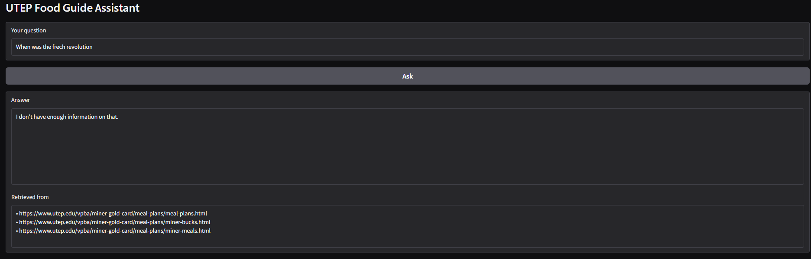

# The Unofficial Guide — Project 1

> **How to use this template:**
> Complete each section *after* you've built and tested the corresponding part of your system.
> Do not write placeholder text — if a section isn't done yet, leave it blank and come back.
> Every section below is required for submission. One-liners will not receive full credit.

---

## Domain

<!-- What topic or category of knowledge does your system cover?
     Why is this knowledge valuable, and why is it hard to find through official channels?
     Example: "Student reviews of CS professors at [university] — useful because official
     course descriptions don't reflect teaching style, exam difficulty, or workload." -->

     My system covers food resources around UTEP, including meal plans, Miner Bucks, Miner Meals, campus dining locations, nearby restaurants, and the UTEP Food Pantry.

     This is useful because students may need help deciding where to eat, understanding how campus food payment systems work, or finding food support resources.

     This information is hard to find in one official place because it is spread across multiple UTEP pages, dining service pages, restaurant sites, and review/listing websites.

---

## Document Sources

<!-- List every source you collected documents from.
     Be specific: include URLs, subreddit names, forum thread titles, or file names.
     Aim for variety — sources that together cover different subtopics or perspectives. -->

| # | Source | Type | URL or file path |
|---|--------|------|-----------------|
| 1 | UTEP Meal Plans | URL | https://www.utep.edu/vpba/miner-gold-card/meal-plans/meal-plans.html |
| 2 | Miner Bucks | URL | https://www.utep.edu/vpba/miner-gold-card/meal-plans/miner-bucks.html |
| 3 | Miner Meals | URL | https://www.utep.edu/vpba/miner-gold-card/meal-plans/miner-meals.html |
| 4 | Sodexo Dining Locations | TXT file | data/sodexo_locations.txt |
| 5 | TripAdvisor Restaurants Near UTEP | TXT file | data/tripadvisor_restaurants.txt |
| 6 | OpenTable Restaurants Near UTEP Theater | TXT file | data/opentable_restaurants.txt |
| 7 | Roonee Restaurants Near UTEP Blog | URL | https://roonee.com/restaurants-near-the-university-of-texas-at-el-paso/ |
| 8 | UTEP Food Pantry FAQ | URL | https://www.utep.edu/student-affairs/foodpantry/faq/ |
| 9 | UTEP Food Pantry About Us | URL | https://www.utep.edu/student-affairs/foodpantry/about-us/|
| 10 | UTEP Food Pantry Location and Schedule | URL | https://www.utep.edu/student-affairs/foodpantry/visit-us/ |

---

## Chunking Strategy

<!-- Describe your chunking approach with enough specificity that someone else could reproduce it.
     Include:
     - Chunk size (characters or tokens) and why that size fits your documents
     - Overlap size and why (or why not) you used overlap
     - Any preprocessing you did before chunking (e.g., stripping HTML, removing headers)
     - What your final chunk count was across all documents -->

**Chunk size:**
200

**Overlap:**
50, this size was chosen because it is big enough to give a big amount of additional context to the chunck without making it too big.

**Preprocessing:**
Documents were mostly webpages, FAQs, meal plan descriptions, and restaurant listings.

HTML and navigation text were cleaned before chunking.

Some websites blocked scrapping attempts so they had to be manually edited into a .txt file

**Why these choices fit your documents:**
most of the information in the documents is not extremely long as to make a bigger chunk count. In addition this size is big enough to cover most sentences and even some section such as:

Restaurant name
Rating: 4
Location place
Serves: Mexican Food.

In addition the overlap helps information context without loosing to much meaning.

**Final chunk count:**
154 chunks

**Sample Chunks**
{
    "source": "https://www.utep.edu/vpba/miner-gold-card/meal-plans/meal-plans.html",
    "chunk_id": 0,
    "text": "Meal Plans UTEP Business Affairs Meal Plans UTEP Business Affairs Meal Plans FY27 Meal Plans available for Purchase! With a variety of food options, the Pick 'n Shovel offers students an additional ch"
  },
  {
    "source": "https://www.utep.edu/vpba/miner-gold-card/meal-plans/meal-plans.html",
    "chunk_id": 1,
    "text": "he Pick 'n Shovel offers students an additional choice alongside national brands such as Starbucks and Jamba Juice. The University of Texas at El Paso has expanded its dining choices to encompass a me"
  },
    {
    "source": "https://www.utep.edu/student-affairs/foodpantry/faq/",
    "chunk_id": 0,
    "text": "FAQ - Food Pantry FREQUENTLY ASKED QUESTIONS Frequently Asked Questions What do I need to pick up food at the Food Pantry? Be an active student, faculty and staff member and bring your physical or dig"
  },
    {
    "source": "Restaurants Near UTEP - Trip Advisor.txt",
    "chunk_id": 4,
    "text": "sine: Steakhouse Price: $$$$ Rating: 4.9/5 Review Highlights: - Excellent dinner and drinks Restaurant: Chick-fil-A Distance: 0.2 miles Rating: 5.0/5 Review Highlights: - Highly rated fast food option"
  },
    {
    "source": "https://www.utep.edu/vpba/miner-gold-card/meal-plans/miner-meals.html",
    "chunk_id": 0,
    "text": "Miner Meals UTEP Business Affairs Meal Plans UTEP Business Affairs Meal Plans Miner Meals Miner Meals is a program that offers a 10 percent discount at participating food venues on campus. Funds in Mi"
  }

---

## Embedding Model

<!-- Name the embedding model you used and explain your choice.
     Then answer: if you were deploying this system for real users and cost wasn't a constraint,
     what tradeoffs would you weigh in choosing a different model?
     Consider: context length limits, multilingual support, accuracy on domain-specific text,
     latency, and local vs. API-hosted. -->

**Model used:**
all-MiniLM-L6-v2 this model was chosen since it runs locally meaning it works faster, and it is smart enough for this project. It also is free so there is no restriction towards testing.

**Production tradeoff reflection:**
If costs were not a constraint, I would consider embedding models with higher retieval accuricy and even multilingual support. This is because utep is one of the highest universities with latino students. I would also consider tradeoff between accuracy and latency as larger models provide better results, but requiere more computational power so they might be slower. In addition since the amount of infomration is not that vast it might not have a big impact.

**Retrieval Examples**

UERY: What are Miner Bucks?
------------------------------------------------------------
Distance: 0.6803717613220215
Source: https://www.utep.edu/vpba/miner-gold-card/meal-plans/miner-bucks.html
Chunk ID: 0
Miner Bucks UTEP Business Affairs Meal Plans UTEP Business Affairs Meal Plans Miner Bucks Miner Bucks is a program that allows you to use your Miner Gold Card to make purchases at retail locations on
------------------------------------------------------------
Distance: 0.902823269367218
Source: https://www.utep.edu/vpba/miner-gold-card/meal-plans/miner-bucks.html
Chunk ID: 2
d in Miner Bucks can be used for copies and printing when the semester print allocation runs out. Features No minimum or maximum purchase amount. Allows you to make convenient cashless purchases on ca
------------------------------------------------------------
Distance: 0.9356439709663391
Source: https://www.utep.edu/vpba/miner-gold-card/meal-plans/miner-bucks.html
Chunk ID: 4
ney to your Miner Bucks: 1. In Person: Bring cash or a check to the Cashiers located in the Mike Loya Academic Services Building. 2. Online: Visit https://get.cbord.com/mgco/full/login.php . If you ar

This chunks are relevant since they contain the main information of what miner bucks are and how theay function in the university. It also includes some extra content that they can be used for other purposes

QUERY: Can meal plans be refunded?
------------------------------------------------------------
Distance: 0.8841742873191833
Source: https://www.utep.edu/vpba/miner-gold-card/meal-plans/meal-plans.html
Chunk ID: 9
of a meal plan signifies your understanding of, and agreement to these terms. Faculty and Staff The Meal Plan for Faculty and Staff does roll over from semester to semester, is nonrefundable, and is a
------------------------------------------------------------
Distance: 0.8900141716003418
Source: https://www.utep.edu/vpba/miner-gold-card/meal-plans/meal-plans.html
Chunk ID: 8
ver to spring. Meal Plans, associated dollars, and Flex Dollars, expire the last day of the spring semester. Meal Plans are nontransferable. Purchase of a meal plan signifies your understanding of, an
------------------------------------------------------------
Distance: 0.8964707851409912
Source: https://www.utep.edu/vpba/miner-gold-card/meal-plans/meal-plans.html
Chunk ID: 6
uten and allergen-free foods. Meal Plan Terms: Meal Plans cannot be cancelled, changed, or refunded, after census day of each semester. Students may cancel ONE (1) meal plan per semester . Meal Plans

This chunks are really important since the go in depth about how the meal plan works, however it is a good thing to choose multiple chunks, in this example the most important chunk is the last one being retrieved.

QUERY: Is Einsten bagels open during summer?
------------------------------------------------------------
Distance: 0.8531708717346191
Source: utep_dining_locations.txt
Chunk ID: 2
Break: Closed All Day Einsteins Bagels Bros Catering Menu → Status: closed. Service hours: More information available. Closed Miner Stop Special Hours Summer Break: Closed All Day Status: closed. Ser
------------------------------------------------------------
Distance: 0.9665122032165527
Source: utep_dining_locations.txt
Chunk ID: 1
Building El Paso Natural GCC Dining Hall Status: closed. Service hours: More information available. Closed Einstein Bros. Bagels Special Hours Summer Break: Closed All Day Einsteins Bagels Bros Cater
------------------------------------------------------------
Distance: 1.0683915615081787
Source: utep_dining_locations.txt
Chunk ID: 14
ble. Closed Starbucks Special Hours Summer Break: Closed All Day Starbucks Catering Menu → Status: closed. Service hours: More information available. Closed Sandella's Special Hours Summer Break: Clos

## Grounded Generation

<!-- Explain how your system enforces grounding — how does it prevent the LLM from answering
     beyond the retrieved documents?
     Describe both your system prompt (what instruction you gave the model) and any structural
     choices (e.g., how you formatted the context, whether you filtered low-relevance chunks).
     Do not just say "I told it to use the documents" — show the actual instruction or explain
     the mechanism. -->

**System prompt grounding instruction:**
The system prompt instructs the model to answer using only the retrieved context. The prompt explicitly states "Answer the user's question using ONLY the context below" and "Do not use outside knowledge." If the retrieved documents do not contain enough information, the model is instructed to respond with "I don't have enough information on that."

**How source attribution is surfaced in the response:**
Source attribution is generated programmatically rather than relying on the LLM. After retrieval, the system collects the source from each retrieved chunk and displays the list of source documents alongside the generated answer.

**Source attribution examples**
Question:
can faculty get food from the food pantry??

System Response:
Yes, faculty can get food from the food pantry, but they must be currently employed and bring their Miner Gold Card each time they visit.

Sources:
• https://www.utep.edu/student-affairs/foodpantry/faq/

Question:
what kind of food does amar serve?

System Response:
Amar serves Peruvian and Mexican food, based on family flavors.

Sources:
• Restaurants Near UTEP Theater - OpenTable.txt
• https://roonee.com/restaurants-near-the-university-of-texas-at-el-paso/
• https://www.utep.edu/vpba/miner-gold-card/meal-plans/meal-plans.html

**Out of Scope Example**

---

## Evaluation Report

<!-- Run your 5 test questions from planning.md through your system and record the results.
     Be honest — a partially accurate or inaccurate result that you explain well is more
     valuable than a suspiciously perfect result. -->

| # | Question | Expected answer | System response (summarized) | Retrieval quality | Response accuracy |
|---|----------|-----------------|------------------------------|-------------------|-------------------|
| 1 | How Much does the Blocks of 60 meals plan cost | $710.48 | The Block of 60 Meals plan costs $614.42, which includes $50 Miner Plan Dollars. | Partially relevant | Inaccurate |
| 2 | Is Einstein Bros. Bagels open in summer? | No it is closed | No, according to the context, Einstein Bros. Bagels is closed during summer break, with a status of "closed" and special hours stating "Closed All Day". | Relevant | Accurate |
| 3 | What do I need to pick up food at the Food Pantry? | Be an active student, faculty and staff member and bring your physical or digital UTEP ID. | To pick up food at the Food Pantry, you need to be an active student, faculty, or staff member and bring your physical or digital UTEP ID. Faculty and staff must also be currently employed. | Relevant | Accurate |
| 4 | What type of food does Amar serve? | Peruvian | Amar serves Peruvian and Mexican food, based on family flavors. | Relevant | Accurate |
| 5 | What is the rating of Raisin Canes | 4.4 | The rating of Raising Cane's Chicken Fingers is 4.4/5. | Relevant | Accurate |

**Retrieval quality:** Relevant / Partially relevant / Off-target  
**Response accuracy:** Accurate / Partially accurate / Inaccurate

---

## Failure Case Analysis

<!-- Identify at least one question where retrieval or generation did not work as expected.
     Write a specific explanation of *why* it failed, tied to a part of the pipeline.

     "The answer was wrong" is not an explanation.

     "The relevant information was split across a chunk boundary, so retrieval returned
     only half the context — the model didn't have enough to answer correctly" is an explanation.

     "The embedding model treated the professor's nickname as out-of-vocabulary and returned
     results from an unrelated review" is an explanation. -->

**Question that failed:**
How Much does the Blocks of 60 meals plan cost

**What the system returned:**
The Block of 60 Meals plan costs $614.42, which includes $50 Miner Plan Dollars.

when it should have been : The Block of 60 Meals plan costs $710.48, which includes $50 Miner Plan Dollars.

**Root cause (tied to a specific pipeline stage):**
The root cause was in the chunking process the, chunk that contains many other meal plan costs. The LLM is getting confused with the other meal plans being in that chunk.

**What you would change to fix it:**
A good way to fix this could be to have smaller chunks for this section focusing on it not being bigger then the meal plan option.

---

## Spec Reflection

<!-- Reflect on how planning.md shaped your implementation.
     Answer both questions with at least 2–3 sentences each. -->

**One way the spec helped you during implementation:**
The planning helped me organized the project before I even coded. Specially witht the use of documentation, in what I was going to use and how should I scrape information from it. This helped me go faster during the 

**One way your implementation diverged from the spec, and why:**

---

## AI Usage

<!-- Describe at least 2 specific instances where you used an AI tool during this project.
     For each: what did you give the AI as input, what did it produce, and what did you
     change, override, or direct differently?

     "I used Claude to help me code" is not sufficient.
     "I gave Claude my Chunking Strategy section from planning.md and asked it to implement
     chunk_text(). It returned a function using a fixed character split. I overrode the
     chunk size from 500 to 200 because my documents are short reviews, not long guides." -->

**Instance 1**

- *What I gave the AI:* I provided the project instructions, my document sources, and my desired chunk size and overlap.
- *What it produced:* It generated code to scrape webpages, clean the text, split documents into chunks, and save the chunks to a JSON file.
- *What I changed or overrode:* I adjusted the chunk size to 200 characters with a 50-character overlap and added additional cleaning rules to remove navigation menus, page headers, and other irrelevant content.

**Instance 2**

- *What I gave the AI:* I provided the Milestone 5 requirements, my retrieval function, and the requirement that the model answer only from retrieved documents and include source attribution.
- *What it produced:* The AI generated code for the query pipeline, including the prompt template, Groq API integration, and a Gradio interface that allowed users to submit questions and receive answers.
- *What I changed or overrode:* I modified the prompt to more strongly enforce grounding by instructing the model to answer only from the retrieved context and not use outside knowledge. I also ensured that source attribution was generated programmatically from the retrieved chunks rather than relying on the model to cite sources on its own.
